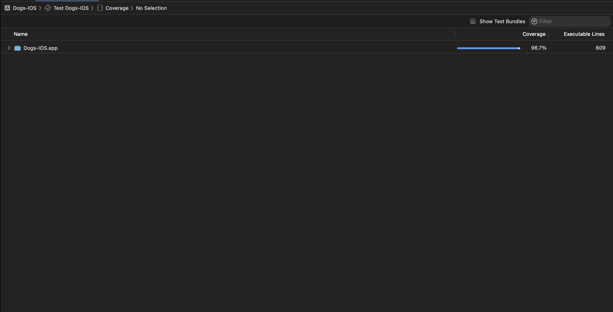

# Dogs-IOS App

## Overview
The Dogs-IOS app is a iOS test application designed for dog lovers. It fetches a list of dogs from a provided endpoint and persists the data using CoreData for offline viewing. This project is a technical test for Konfio and showcases the application's robust architecture, high testing coverage, and adherence to best coding practices.

## Architecture
This application utilizes the MVVM (Model-View-ViewModel) architecture pattern, ensuring a clean separation of concerns. It leverages SwiftUI for its reactive user interface components and Combine for handling asynchronous events.

### Components:
- **Model**: Defines the data structure and CoreData entities.
- **View**: Represents the UI components built with SwiftUI.
- **ViewModel**: Acts as a bridge between the Model and the View, managing the presentation logic.

## Testing
The app prides itself on having over 90% test coverage, ensuring reliability and robustness. Unit tests have been written for the majority of the functionalities, using XCTest framework.

## Design Patterns and Best Practices
- **Factory Pattern**: Used for creating ViewModels to ensure flexibility and testability.
- **Repository Pattern**: Encapsulates the logic for accessing data sources, making it easier to switch between remote and local data fetching strategies.
- **Protocol-Oriented Programming**: Used extensively to provide clear contracts for components and facilitate dependency injection for testing.

## Features
- Fetch and display a list of dogs from an endpoint.
- Local data persistence with CoreData.
- Modern UI.

## Getting Started
To run the Dogs-IOS app on your local machine, clone the repository and open the project in Xcode. Run the app in the simulator or on a physical device.

git clone https://github.com/carlosmolina19/Dogs-IOS

## Contributions
Contributions are welcome.

## Contact
For questions or feedback, please reach out to carlosamolina19@gmail.com.

